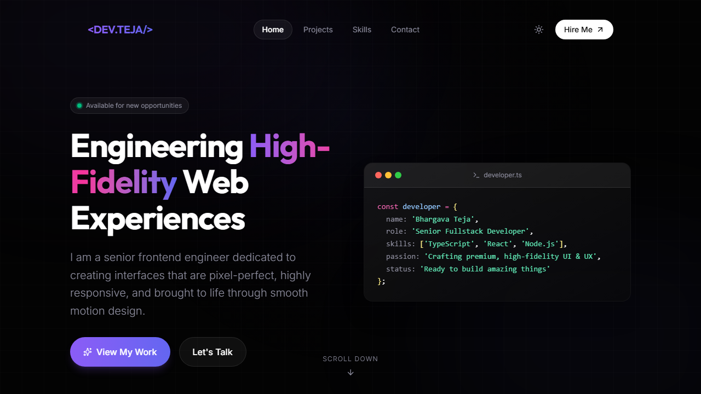

# Premium React Developer Portfolio



## 1. Project Overview
This is a premium dark-themed React developer portfolio built with Vite, TypeScript, TailwindCSS, and Framer Motion. It features deep dark gradient accents, glassmorphic UI elements, custom spring-based cursor tracking, interactive mouse-responsive grid backgrounds, filterable projects, and a fully validated contact form.

## 2. The Prompt Used to Build This
```
/startcycle Build my personal React developer portfolio. Read agents.md for the team rules. Start with DevOps setting up Vite + React + TailwindCSS + Framer Motion. Then Designer defines the design system. Then Frontend builds all pages. Then QA checks in the browser. Dark, premium, unique — think Linear.app meets awwwards.com. Four sections: Hero (animated intro + cursor effect), Projects (filterable cards with hover animations), Skills (animated tech stack grid), Contact (form using Web3Forms free API). All content is dummy placeholder. No auth needed. Make it so impressive a hiring manager stops scrolling.
```

## 3. Tech Stack
- **Core**: React 19, Vite 8, TypeScript (strict mode)
- **Styling**: TailwindCSS 4 (using the official Vite plugin)
- **Animations**: Framer Motion 12 (spring cursors, stagger reveals)
- **Forms & Validation**: React Hook Form, Zod
- **Icons**: Lucide React
- **Package Manager**: pnpm

## 4. Contact Form Setup (Web3Forms)
- Web3Forms is 100% free — 250 submissions/month, no account needed to start.
- Go to [https://web3forms.com](https://web3forms.com) → enter your email → get your access key instantly.
- Create a `.env` file in the project root and add:
  ```env
  VITE_WEB3FORMS_KEY=your_key_here
  ```
- The contact form in `src/components/Contact.tsx` is already wired up — just add your key.

## 5. How to Run Locally
```bash
pnpm install
pnpm run dev
```

## 6. How to Deploy (Free)
1. Run the build command to generate the production bundle:
   ```bash
   pnpm run build
   ```
2. Drag the output `dist/` folder to [https://netlify.com/drop](https://netlify.com/drop) to get a live URL in 30 seconds.

## 7. How to Customize Content
All dummy content lives in:
- `src/types/portfolio.types.ts` for interfaces and Zod schemas.
- Projects list: `projectsData` inside [src/components/Projects.tsx](file:///c:/antigravity-test/my-portfolio/src/components/Projects.tsx)
- Skills list: `skillsData` inside [src/components/Skills.tsx](file:///c:/antigravity-test/my-portfolio/src/components/Skills.tsx)
Edit your name, projects, and skills directly in these files.
